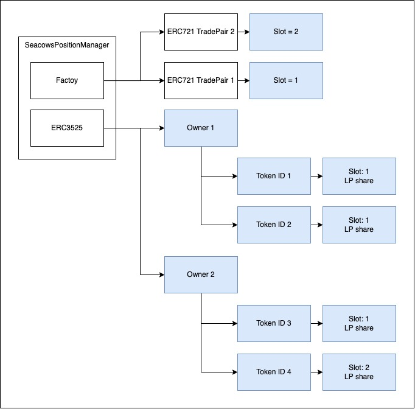
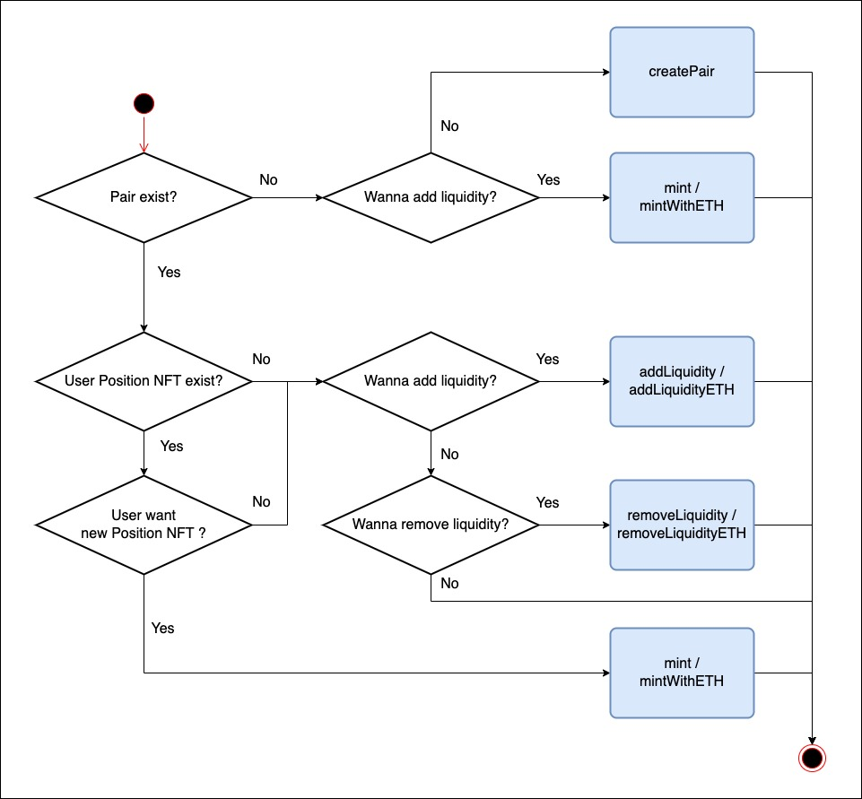

# Seacows AMM

This repository contains the smart contracts for the Seacows AMM Protocol.

## Main contracts

There are 2 main contracts in this package:

- SeacowsERC721TradePair
- SeacowsPositionManager

For frontend integration, it should interact with SeacowsPositionManager directly.

## Functions

### SeacowsPositionManager

| Functions              | Description                                                                                                                         |
| ---------------------- | ----------------------------------------------------------------------------------------------------------------------------------- |
| createPair             | <ol><li>Create Trade Pair</li><li>Mint Position NFT for the Pair</li></ol>                                                          |
| addLiquidity           | Add ERC20 and ERC721 liquidity to an existing Position NFT of existing Pair                                                         |
| addLiquidityETH        | Convert ETH to WETH and add WETH and ERC721 liquidity to an existing Position NFT of existing Pair                                  |
| removeLiquidity        | Remove liquidity ERC20 and ERC721 from Position NFT of existing Pair and transfer asset to receiver specified                       |
| removeLiquidityETH     | Remove liquidity WETH and ERC721 from Position NFT of existing Pair, convert to ETH and transfer assets to receiver specified       |
| mint                   | <ol><li> Create Pair if not exist</li><li>Mint new Position NFT for to the user</li><li>Add liquidity to new Position NFT</li></ol> |
| mintWithETH            | Similar to `mint` but receive ETH and convert it to WETH                                                                            |
| swapTokensForExactNFTs | It is used to buy NFT from the Pair                                                                                                 |
| swapExactNFTsForTokens | It is used to sell NFT to the Pair                                                                                                  |
| slotOfPair             | Get the slot number of the Pair                                                                                                     |
| tokenOf                | Get the Position NFT of the Pair                                                                                                    |

## User flow

### Create Pair

